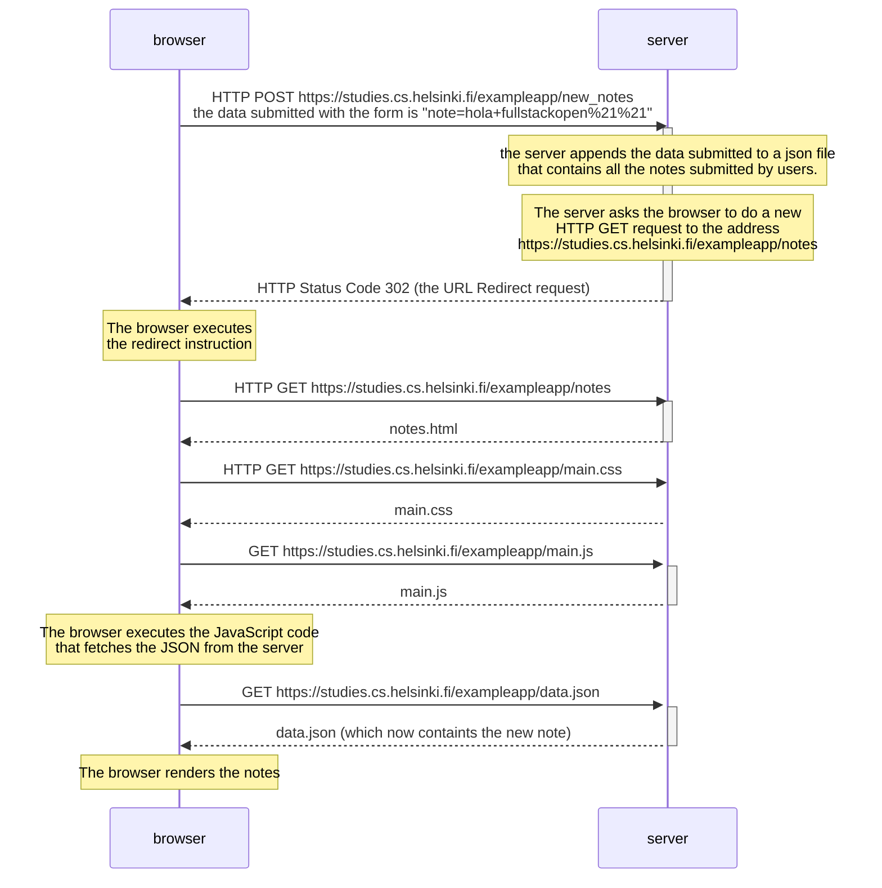

The following diagram describes the situation where an user creates a new note
on the page https://studies.cs.helsinki.fi/exampleapp/notes by writing "hola
fulstackopen!!" into the text field and clicking the Save button.

