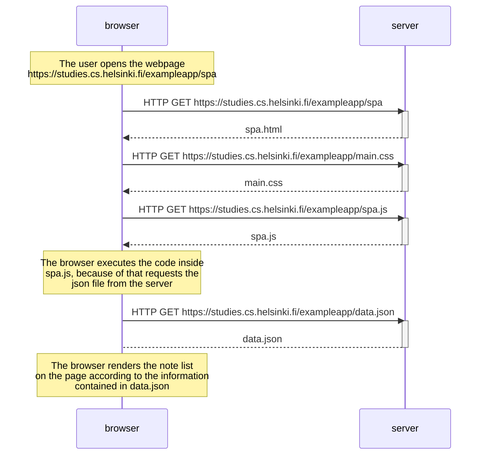

This diagram describes what happens when an user goes to
https://studies.cs.helsinki.fi/exampleapp/spa.

```mermaid
sequenceDiagram
    participant browser
    participant server
			
	note over browser: The user opens the webpage <br>https://studies.cs.helsinki.fi/exampleapp/spa
	
	browser->>server: HTTP GET https://studies.cs.helsinki.fi/exampleapp/spa
		
	activate server
	
	server-->>browser: spa.html
	
	deactivate server
		
	browser->>server: HTTP GET https://studies.cs.helsinki.fi/exampleapp/main.css
		
	activate server
	
	server-->>browser: main.css
	
	deactivate server
	
	browser->>server: HTTP GET https://studies.cs.helsinki.fi/exampleapp/spa.js

	activate server
	
	server-->>browser: spa.js
	
	deactivate server
		
	note over browser: The browser executes the code inside<br> spa.js, because of that requests the<br> json file from the server
	
	browser->>server: HTTP GET https://studies.cs.helsinki.fi/exampleapp/data.json
		
	activate server 
	
	server-->browser: data.json
	
	deactivate server
		
	note over browser: The browser renders the note list<br> on the page according to the information<br> contained in data.json
```
