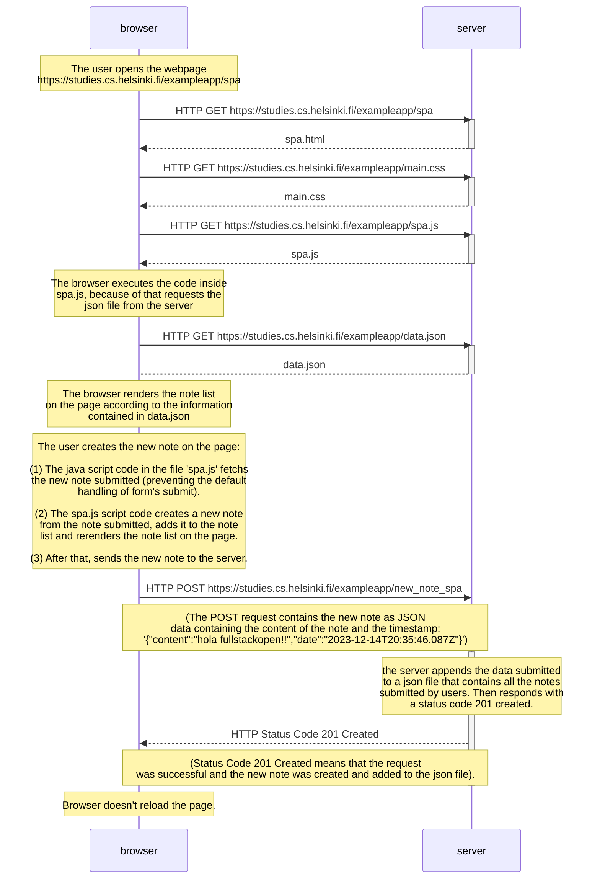

This diagram describes what happens when an user goes to
https://studies.cs.helsinki.fi/exampleapp/spa and creates a new note by writing
"hola fulstackopen!!" into the text field and clicking the Save button.

